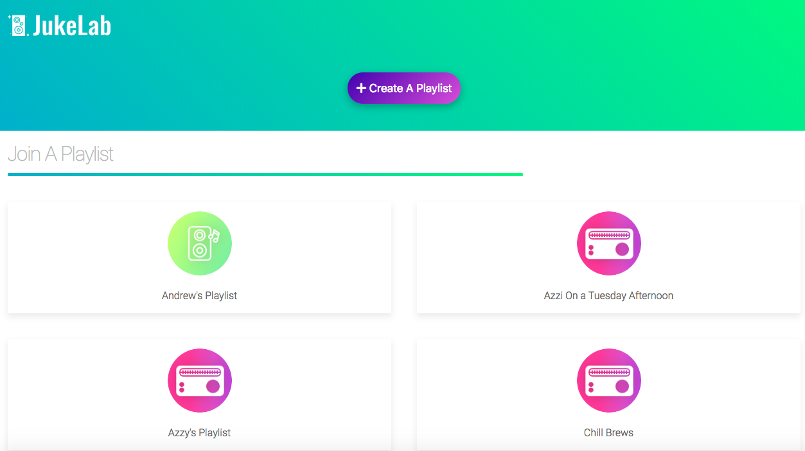
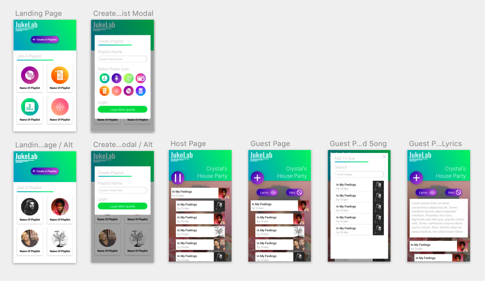
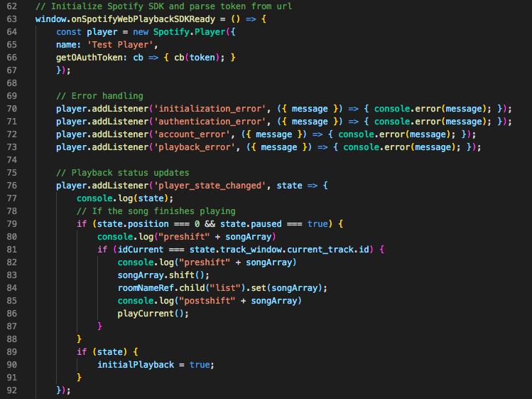

# JukeLab
https://aehaq.github.io/JukeLab/

# About JukeLab
Hosting a party and looking for the perfect playlist? If you want tunes that satisfy all your buds, open up JukeLab and you and your friends can create a collaborative dynamic playlist for your get together! With JukeLab you can add songs from any browser, whether it’s on your phone or at your desktop. 

# Images
* On Desktop

 * On Mobile

# Technologies
* AJAX - POST & PUT calls
* APIs - Spotify, Lyrics by Apiseeds
* JQuery
* Firebase
* UIkit
* Spotify SDK
* User Input Validation - Prevent users from adding duplicate or empty playlist names

# Features
* Collaborative dynamic playlist
* Multiple users joining playlist from either desktop or mobile
* Play / Pause / Skip
* Lyrics display

# Author
* [Azfar E Haq](https://github.com/aehaq)
* [Andrew Ton](https://github.com/atton88)
* [Craig Melville](https://github.com/acekreations) 
* [Shuhan Laura Lee](https://github.com/lalatw)

# Code snippets

# License
Standard MIT License